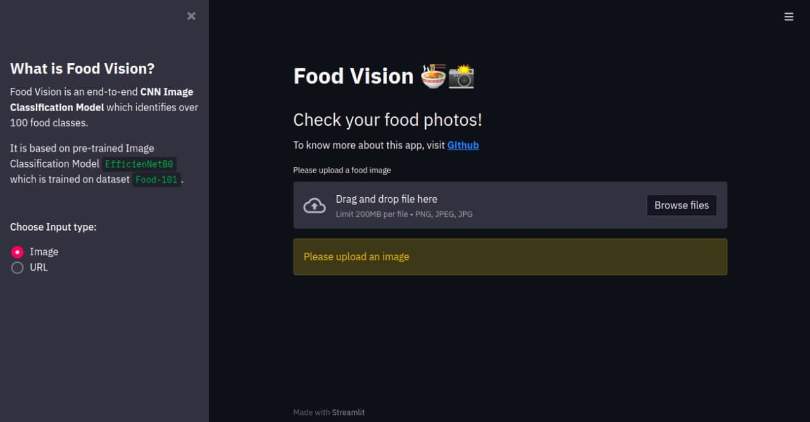

# Food-Vision 🍜 📸

Built an end-to-end **CNN Image Classification Model** which identifies the food in your image.

I have used an pre-trained Image Classification Model, EfficientNetB0, previously pre-trained on ImageNet, that comes with Tensorflow and then retrained it on [Food 101 Dataset](https://www.kaggle.com/kmader/food41) dataset.

## Fun Fact

This model actually beats the [DeepFood](https://arxiv.org/abs/1606.05675) Paper's model which also trained on the same dataset.

The Accuracy of DeepFood was **77.4%** and our models is **79%**. It is not much but, we take those.


## How can you use it?

Finally after training the model, I have exported as `.h5` files and then integrated it with **Streamlit Web App**

### Try it out yourself, [Click Here!](https://what-you-eating.heroku.com)


<div align="center">
  
 
</div>

Once the app is loaded,

1. Choose the input type. Whether you want to upload an image or enter URL of an image
2. For upload an image option, choose image from your computer.
3. For URL option, erase the existing url and enter your own url and press enter
4. Once you have done the above, the model will predict the output and display the **Top-5 Predictions**


### Installation

1. Clone the repo
   ```sh
   git clone https://github.com/mSounak/Food-Vision
   ```
2. install `requirements.txt`
   ```sh
   pip install -r requirements.txt
   ```
3. run app.py
   ```sh
   streamlit run app.py
   ```

<!-- CONTRIBUTING -->
## Contributing

Contributions are what make the open source community such an amazing place to be learn, inspire, and create. Any contributions you make are **greatly appreciated**.

1. Fork the Project
2. Create your Feature Branch (`git checkout -b feature/AmazingFeature`)
3. Commit your Changes (`git commit -m 'Add some AmazingFeature'`)
4. Push to the Branch (`git push origin feature/AmazingFeature`)
5. Open a Pull Request


<hr>


<!-- MARKDOWN LINKS & IMAGES -->
<!-- https://www.markdownguide.org/basic-syntax/#reference-style-links -->
